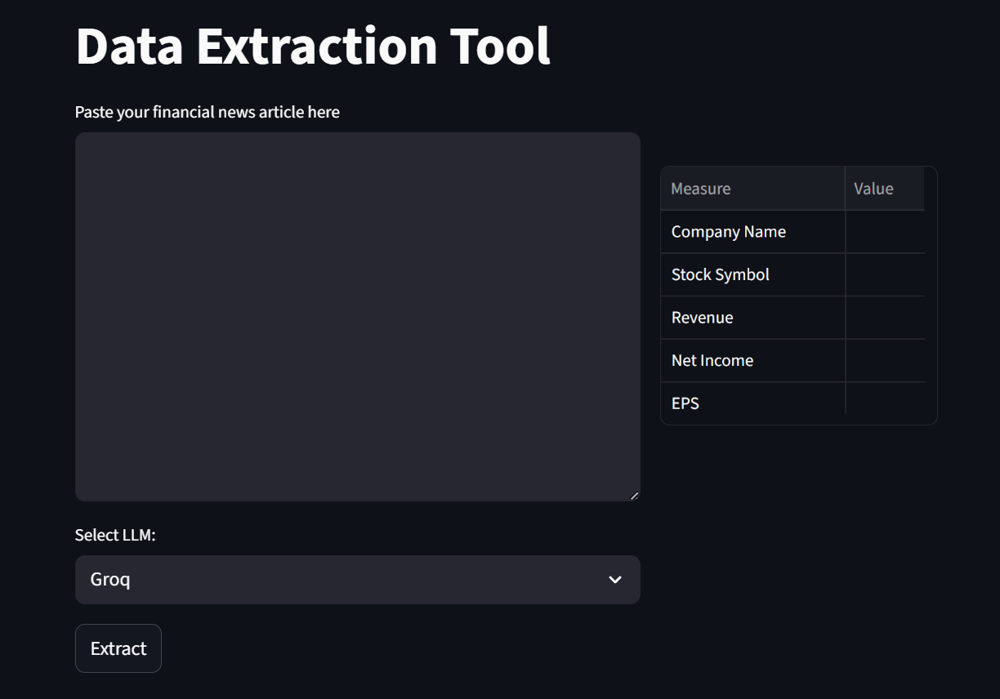

### Financial Data Extraction Tool Using LLM API (OpenAI / Groq)

This tool is a streamlit based app that uses openai api to extract key financial measures such as company name, stock symbol, revenue, net income etc. from a news article. The news article is typically an article about company's finance reporting. 




### Installation

```doctest
pip install -r requirements.txt
```
You need to create an account on openai and groq website. 
You will get inital 5$ free credits which is more than enough for this project.
Once you get an api key from your openai and groq account create a .env file at the project root and add the keys to .env
