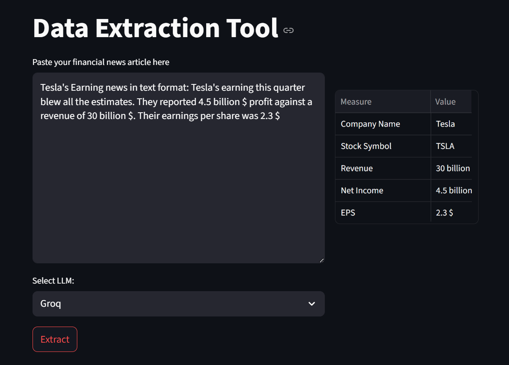

# Financial Data Extraction Tool Using LLM API (OpenAI / Groq)

This tool is a streamlit based app that uses openai api to extract key financial measures such as company name, stock symbol, revenue, net income etc. from a news article. The news article is typically an article about company's finance reporting. 




## Setup

### 1. Clone the repository
```bash
https://github.com/sumitdas1984/financial_data_extraction_tool.git
```

### 2. Create a Python environment
Python 3.8 or higher using `pyenv`. 

``` bash
cd financial_data_extraction_tool
python3 -m venv .venv
source .venv/bin/activate
```

### 3. Install the required dependencies
```bash
pip install -r requirements.txt
```

### 4. Set up the keys in a .env file
- Create a `.env` file in the root directory of the project. 
- Add your OpenAI and Groq API key in `.env` file.

## How to run the streamlit app
In commandline run
```bash
streamlit run main.py
```

## Dockerization of the App

This application is containerized using Docker to ensure consistency across different environments and ease of deployment.

### Dockerfile Explanation

- **Base Image**: We use the official Python image to ensure compatibility with our application.
- **Working Directory**: The working directory is set to `/app` where the application code resides.
- **Dependencies**: The application dependencies are installed from `requirements.txt`.
- **Copying Files**: The application code and `.env` file are copied into the container.
- **Exposing Ports**: Port 8501 is exposed for accessing the Streamlit application.
- **Running the Application**: The application is started using Streamlit.

## Local Docker Deployment

### Prerequisites

- Docker must be installed on your local machine.

### Building the Docker Image

Run the following command to build the Docker image:

```bash
docker build -t financial_data_extraction_tool .
```

### Running the Docker Container

To run the Docker container, use:

```bash
docker run -p 8501:8501 financial_data_extraction_tool
```

### Accessing the Application

Open your web browser and go to `http://localhost:8501` to access the application.

### Environment Variables

Manage your environment variables using the `.env` file and the `python-dotenv` package.

```javascript

This documentation will help users understand how to use Docker with your application effectively. If you would like to add or modify any specific sections, please let me know!
```
